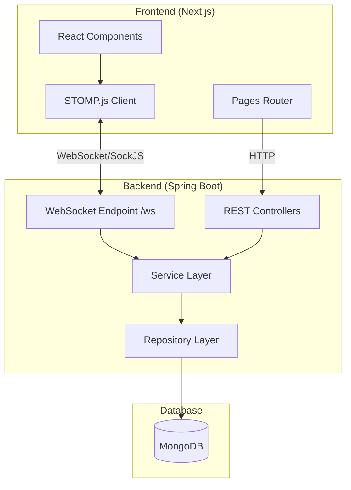
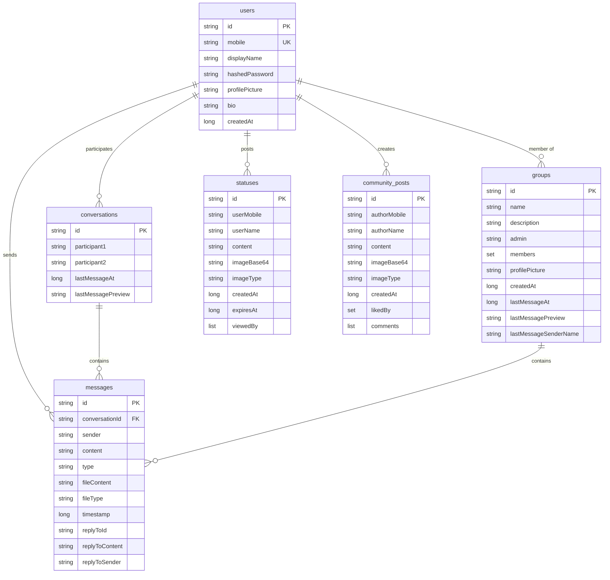

# 📱 ChatterBox - Complete Interview Guide

> A comprehensive real-time chat application built with Spring Boot, WebSocket/STOMP, MongoDB, and Next.js

---

## 📋 Table of Contents
1. [Project Overview](#project-overview)
2. [Technology Stack](#technology-stack)
3. [System Architecture](#system-architecture)
4. [Core Features](#core-features)
5. [Database Design](#database-design)
6. [API Endpoints](#api-endpoints)
7. [Frontend Structure](#frontend-structure)
8. [Security Implementation](#security-implementation)
9. [Performance Optimizations](#performance-optimizations)
10. [Deployment Options](#deployment-options)
11. [Common Interview Questions & Answers](#common-interview-questions--answers)

---

## 🎯 Project Overview

**ChatterBox** is a full-stack, real-time messaging application inspired by WhatsApp. It provides:

- **Real-time messaging** using WebSocket/STOMP protocol
- **1:1 and Group chats** with message persistence
- **Status/Stories feature** with 24-hour expiry (like WhatsApp Status)
- **Community posts** with likes and comments (social media integration)
- **File sharing** with image support up to 5MB
- **Modern responsive UI** with dark mode support

### Why I Built This Project
- To demonstrate proficiency in **real-time communication** patterns
- To showcase **full-stack development** skills (Java backend + React frontend)
- To implement **production-ready features** like authentication, security, and deployment

---

## 🛠️ Technology Stack

### Backend (Spring Boot 2.7.18)
| Technology | Purpose |
|------------|---------|
| **Java 17** | Programming language |
| **Spring Boot 2.7.18** | Application framework |
| **Spring WebSocket** | Real-time bidirectional communication |
| **STOMP Protocol** | Messaging protocol over WebSocket |
| **SockJS** | WebSocket fallback for older browsers |
| **MongoDB** | NoSQL database for flexible document storage |
| **Spring Data MongoDB** | Database abstraction layer |
| **JWT (jjwt 0.11.5)** | Token-based authentication |
| **BCrypt** | Password hashing |
| **Bean Validation** | Input validation (@NotBlank, @Size) |

### Frontend (Next.js 14)
| Technology | Purpose |
|------------|---------|
| **Next.js 14.2.35** | React framework with SSR |
| **React 18.2** | UI library |
| **TypeScript 5.3** | Type safety |
| **TailwindCSS 3.4** | Utility-first CSS framework |
| **@stomp/stompjs** | STOMP client for WebSocket |
| **SockJS-client** | WebSocket fallback |
| **Lucide-react** | Icon library |

### DevOps & Deployment
| Technology | Purpose |
|------------|---------|
| **Docker** | Containerization |
| **Kubernetes** | Container orchestration |
| **Maven** | Build tool |
| **Vercel** | Frontend deployment |
| **Railway** | Backend deployment |

---

## 🏗️ System Architecture



### Architecture Pattern: **Layered Architecture**

```
┌─────────────────────────────────────────────────────┐
│                    Controllers                       │
│   (AuthController, ConversationController, etc.)    │
├─────────────────────────────────────────────────────┤
│                    Services                          │
│   (UserService, ChatService, GroupService, etc.)    │
├─────────────────────────────────────────────────────┤
│                   Repositories                       │
│   (UserRepository, ChatMessageRepository, etc.)     │
├─────────────────────────────────────────────────────┤
│                    MongoDB                           │
│   (users, conversations, messages, groups, etc.)    │
└─────────────────────────────────────────────────────┘
```

---

## ⭐ Core Features

### 1. Real-Time Messaging

**How it works:**
1. Client connects to `/ws` endpoint using SockJS
2. STOMP protocol handles message framing
3. Messages sent to `/app/chat.sendMessage` are processed by `ChatBotController`
4. Server broadcasts to subscribers via `/topic/public` or sends to specific users via `/user/{mobile}/queue/messages`

**Message Types (Entity.MessageType enum):**
```java
CHAT,       // Regular text message
JOIN,       // User joined notification
LEAVE,      // User left notification
TYPING,     // Typing indicator
FILE,       // File/image message
READ,       // Read receipt
DELIVERED   // Delivery confirmation
```

### 2. 1:1 Private Conversations

- **Conversation ID**: Auto-generated when two users start chatting
- **Message Routing**: Uses `SimpMessagingTemplate.convertAndSendToUser()` for targeted delivery
- **Persistence**: Messages stored in MongoDB with `conversationId` field

### 3. Group Chats

- **Admin Role**: Creator becomes admin
- **Member Management**: `Set<String>` stores member mobile numbers
- **Broadcasting**: Messages sent to all group members via loop

### 4. Status/Stories (24-Hour Expiry)

```java
// StatusDocument.java
this.expiresAt = this.createdAt + (24 * 60 * 60 * 1000); // 24 hours
```

Features:
- Text and/or image content
- View tracking (`viewedBy` list)
- Auto-expiry using `expiresAt > currentTime` query

### 5. Community Posts

- **Social media-style feed**
- **Like/Unlike toggle** functionality
- **Comments** with nested comment structure
- **Author ownership** for delete permissions

### 6. Reply-to-Message

```java
// Entity.java
private String replyToId;
private String replyToContent;
private String replyToSender;
```

### 7. Typing Indicators

- Real-time typing status via WebSocket
- Sent to specific conversation participant

### 8. Read Receipts

- `READ` message type for delivery confirmation
- Per-conversation tracking

---

## 🗄️ Database Design

### Collections (MongoDB)



### Indexes
- `users.mobile` - Unique index for fast lookup
- `messages.conversationId` - For efficient message retrieval

---

## 🔌 API Endpoints

### Authentication (`/api/auth`)
| Method | Endpoint | Description |
|--------|----------|-------------|
| POST | `/signup` | Register with mobile, displayName, password |
| POST | `/login` | Authenticate and receive JWT token |
| POST | `/register` | Legacy registration (no password) |

### Conversations (`/api/conversations`)
| Method | Endpoint | Description |
|--------|----------|-------------|
| GET | `/?mobile=xxx` | List all conversations for user |
| POST | `/?mobile=xxx` | Create/get conversation with another user |
| GET | `/{id}?mobile=xxx` | Get conversation details |
| GET | `/{id}/messages?mobile=xxx&limit=50` | Get messages (max 100) |
| POST | `/{id}/messages?mobile=xxx` | Send message |
| DELETE | `/{id}?mobile=xxx` | Delete conversation |

### Groups (`/api/groups`)
| Method | Endpoint | Description |
|--------|----------|-------------|
| POST | `/` | Create new group |
| GET | `/?mobile=xxx` | Get user's groups |
| GET | `/{id}` | Get group details |

### Status (`/api/status`)
| Method | Endpoint | Description |
|--------|----------|-------------|
| POST | `/?mobile=xxx` | Create status |
| GET | `/?mobile=xxx` | Get all active statuses |
| GET | `/my?mobile=xxx` | Get my statuses |
| POST | `/{id}/view?mobile=xxx` | Mark as viewed |
| DELETE | `/{id}?mobile=xxx` | Delete my status |

### Community (`/api/community`)
| Method | Endpoint | Description |
|--------|----------|-------------|
| POST | `/?mobile=xxx` | Create post |
| GET | `/` | Get all posts |
| POST | `/{id}/like?mobile=xxx` | Toggle like |
| POST | `/{id}/comment?mobile=xxx` | Add comment |
| DELETE | `/{id}?mobile=xxx` | Delete post |

### WebSocket Endpoints
| Destination | Description |
|-------------|-------------|
| `/ws` | WebSocket connection (SockJS) |
| `/app/chat.sendMessage` | Send message |
| `/app/chat.addUser` | Join chat |
| `/app/chat.typing` | Typing indicator |
| `/app/chat.read` | Read receipt |
| `/app/chat.sendFile` | Send file |
| `/topic/public` | Public broadcast channel |
| `/user/{mobile}/queue/messages` | Private user queue |

---

## 🖥️ Frontend Structure

```
frontend/src/
├── pages/
│   ├── index.tsx        # Login/Signup page
│   ├── chats.tsx        # Conversation list
│   ├── chat.tsx         # Chat interface
│   ├── groups.tsx       # Group list
│   ├── status.tsx       # Status/Stories
│   ├── community.tsx    # Community feed
│   ├── settings.tsx     # User settings
│   ├── desktop.tsx      # Desktop layout (WhatsApp Web style)
│   └── think.tsx        # Additional feature
├── components/
│   └── [Reusable components]
├── services/
│   └── [API services]
├── styles/
│   └── [CSS/Tailwind]
└── utils/
    └── [Utility functions]
```

---

## 🔒 Security Implementation

### 1. Authentication (JWT)
```java
// JwtService.java
public String generate(String mobile) {
    return Jwts.builder()
        .setSubject(mobile)
        .setIssuedAt(new Date())
        .setExpiration(new Date(System.currentTimeMillis() + expirationMs))
        .signWith(key)
        .compact();
}
```
- **Algorithm**: HMAC-SHA256
- **Default Expiry**: 7 days (604800000ms)
- **Secret**: Configured via `jwt.secret` property

### 2. Password Hashing (BCrypt)
```java
user.setHashedPassword(passwordEncoder.encode(password));
```
- Minimum 6 characters required
- Never sent to frontend (`@JsonIgnore` annotation)

### 3. XSS Prevention
```java
private String sanitize(String input) {
    return input.replaceAll("<", "&lt;")
        .replaceAll(">", "&gt;")
        .replaceAll("\"", "&quot;")
        .replaceAll("'", "&#x27;")
        .replaceAll("/", "&#x2F;");
}
```

### 4. Input Validation (Bean Validation)
```java
@NotBlank(message = "Sender is required")
@Size(min = 1, max = 50, message = "Sender must be between 1 and 50 characters")
private String sender;

@Size(max = 2000, message = "Content must not exceed 2000 characters")
private String content;
```

### 5. CORS Configuration
```java
.setAllowedOriginPatterns(
    "http://localhost:3000",
    "https://*.vercel.app",
    "https://*.railway.app"
)
```

### 6. Authorization Checks
- Conversation access: Verify user is participant
- Group access: Verify user is member
- Status/Post deletion: Verify ownership

---

## ⚡ Performance Optimizations

### 1. Database Indexing
- `conversationId` index on messages collection
- Unique index on `mobile` field

### 2. Efficient Membership Checks
```java
// Using dedicated methods instead of loading full lists
boolean isConversationParticipant = conversationService.isUserParticipant(id, mobile);
boolean isGroupMember = groupService.isUserMember(id, mobile);
```

### 3. Message Pagination
```java
@RequestParam(defaultValue = "50") int limit
if (limit > 100) limit = 100; // Cap at 100
```

### 4. WebSocket Configuration
```java
container.setMaxTextMessageBufferSize(10 * 1024 * 1024); // 10MB
container.setMaxSessionIdleTimeout(30000L); // 30 seconds
registration.setSendTimeLimit(30 * 1000); // 30 seconds
```

---

## 🚀 Deployment Options

### Docker
```bash
docker build -t chatterbox:latest .
docker run -p 8080:8080 chatterbox:latest
```

### Docker Compose
```bash
docker-compose up
```

### Kubernetes
```bash
kubectl apply -f k8s-deployment.yaml
```

### Cloud Platforms
- **Frontend**: Vercel, Netlify
- **Backend**: Railway, Render
- **Database**: MongoDB Atlas

---

## 💬 Common Interview Questions & Answers

### Architecture & Design

**Q: Why did you choose WebSocket over HTTP polling for real-time messaging?**

> WebSocket provides full-duplex communication over a single TCP connection, eliminating the overhead of HTTP headers for each message and reducing latency. With HTTP polling, the client would need to constantly request updates, wasting bandwidth and server resources. WebSocket is more efficient for real-time chat where messages need to be delivered instantly.

---

**Q: Why MongoDB instead of a relational database?**

> MongoDB's document model is well-suited for chat applications because:
> 1. **Flexible schema**: Messages can have optional fields (replyTo, fileContent) without requiring nullable columns
> 2. **Horizontal scaling**: Easier to shard for high-volume messaging
> 3. **Embedded documents**: Comments in community posts can be stored as nested arrays
> 4. **Performance**: Fast reads/writes for simple key-value lookups by conversationId

---

**Q: Explain the STOMP protocol and why you chose it?**

> STOMP (Simple Text Oriented Messaging Protocol) is a simple, interoperable protocol for asynchronous messaging. I chose it because:
> 1. **Broker support**: Spring's SimpleBroker provides pub/sub functionality
> 2. **Frame-based**: Easy message framing with headers and body
> 3. **Subscription model**: Clients subscribe to topics/queues for targeted delivery
> 4. **Client libraries**: Excellent JavaScript support via @stomp/stompjs

---

**Q: How would you scale this application for millions of users?**

> 1. **Horizontal scaling**: Deploy multiple backend instances behind a load balancer
> 2. **External message broker**: Replace SimpleBroker with RabbitMQ or Redis for cross-instance messaging
> 3. **Database sharding**: Shard MongoDB by conversationId or userId
> 4. **Caching**: Add Redis for user sessions and presence data
> 5. **CDN**: Serve static assets and media files via CDN
> 6. **Microservices**: Split into dedicated services (Auth, Chat, Status, Community)

---

### Security

**Q: How do you handle authentication in WebSocket connections?**

> The WebSocket handshake passes user identification via the `UserHandshakeHandler`, which extracts the user's mobile number and sets it as the principal. This is used by Spring's `SimpMessagingTemplate.convertAndSendToUser()` to route messages to specific users.

---

**Q: How do you prevent XSS attacks?**

> All user-generated content is sanitized before storage and display by replacing HTML special characters (`<`, `>`, `"`, `'`, `/`) with their HTML entities. This prevents malicious scripts from being executed in the browser.

---

**Q: How secure is JWT for authentication?**

> JWT is signed with HMAC-SHA256 using a server-side secret key. The token includes:
> - Subject (user's mobile number)
> - Issued At timestamp
> - Expiration time (7 days default)
> 
> Limitations I'm aware of:
> - No built-in token revocation (would need blacklist or short expiry)
> - Token stored client-side (vulnerable if XSS occurs)
> - Could add refresh token mechanism for better security

---

### Feature-Specific

**Q: How does the typing indicator work without flooding the server?**

> When a user types, the frontend sends a `TYPING` message type to `/app/chat.typing`. The server looks up the conversation and sends the indicator only to the other participant via their private queue. To prevent flooding, the frontend typically debounces the typing event (sends only when user starts/stops typing).

---

**Q: How do status updates expire after 24 hours?**

> Each status document stores `createdAt` and `expiresAt` (createdAt + 24 hours). When fetching statuses, the query filters: `WHERE expiresAt > currentTime`. Expired statuses remain in the database but are not returned. A background cleanup job could periodically delete expired documents.

---

**Q: How does the reply-to-message feature work?**

> When replying, the frontend sends three additional fields:
> - `replyToId`: Original message ID
> - `replyToContent`: Preview of original message content
> - `replyToSender`: Who sent the original message
> 
> These are stored with the new message and displayed as a quoted reply in the UI.

---

### Performance

**Q: How do you handle large file uploads?**

> Files are converted to Base64 and embedded in the message. The WebSocket is configured for 10MB buffer (to accommodate 5MB file + Base64 overhead ~33%). Server-side validation ensures files don't exceed limits. For production, I would consider:
> - Direct upload to S3/cloud storage
> - Return URL instead of embedding content
> - Support for larger files

---

**Q: What happens if a user is offline when a message is sent?**

> Currently, messages are persisted to MongoDB, so when the user reconnects and loads their conversations, they'll see missed messages. The system tracks delivery/read status. In production, I would add:
> - Push notifications (FCM/APNS)
> - Offline message queue
> - Message delivery confirmation

---

### Code Quality

**Q: What testing approach did you use?**

> The project includes:
> - **Unit tests**: JUnit 5 with Spring Test
> - **Integration tests**: WebSocket connection tests using embedded test server
> - **Embedded MongoDB**: flapdoodle.embed.mongo for test database
> 
> Tests cover context loading, message sending/receiving, and entity validation.

---

**Q: How do you handle errors in WebSocket communication?**

> 1. **Global Exception Handler**: Catches exceptions and returns structured error responses
> 2. **Error Queue**: Clients subscribe to `/queue/errors` for error messages
> 3. **Logging**: Comprehensive SLF4J logging for debugging
> 4. **Session Management**: Handles disconnect events via `SocketEventListener`

---

## 📊 Project Metrics

| Metric | Value |
|--------|-------|
| **Backend Controllers** | 9 |
| **Backend Services** | 6 |
| **MongoDB Collections** | 6 |
| **Frontend Pages** | 11 |
| **API Endpoints** | 20+ |
| **Message Types** | 7 |
| **Lines of Java Code** | ~2000 |
| **Lines of TypeScript** | ~3000 |

---

## 🎓 Key Learnings & Challenges

### Challenges Faced
1. **WebSocket reconnection**: Handling dropped connections gracefully
2. **Message ordering**: Ensuring messages displayed in correct order
3. **File size limits**: Balancing Base64 overhead with usability
4. **Cross-origin issues**: Configuring CORS for production deployments

### Skills Demonstrated
- Full-stack development (Java + React/TypeScript)
- Real-time communication protocols (WebSocket, STOMP)
- NoSQL database design (MongoDB)
- Security best practices (JWT, BCrypt, XSS prevention)
- DevOps (Docker, Kubernetes, CI/CD-ready)
- Modern frontend development (Next.js, TailwindCSS)

---

## 📚 Future Enhancements

1. **End-to-end encryption** for messages
2. **Voice/Video calls** using WebRTC
3. **Push notifications** via FCM
4. **Message search** functionality
5. **User blocking** capability
6. **Message reactions** (emoji reactions)
7. **Microservices** architecture migration
8. **Redis** for session management and caching

---

*Document generated for interview preparation - ChatterBox Project*
